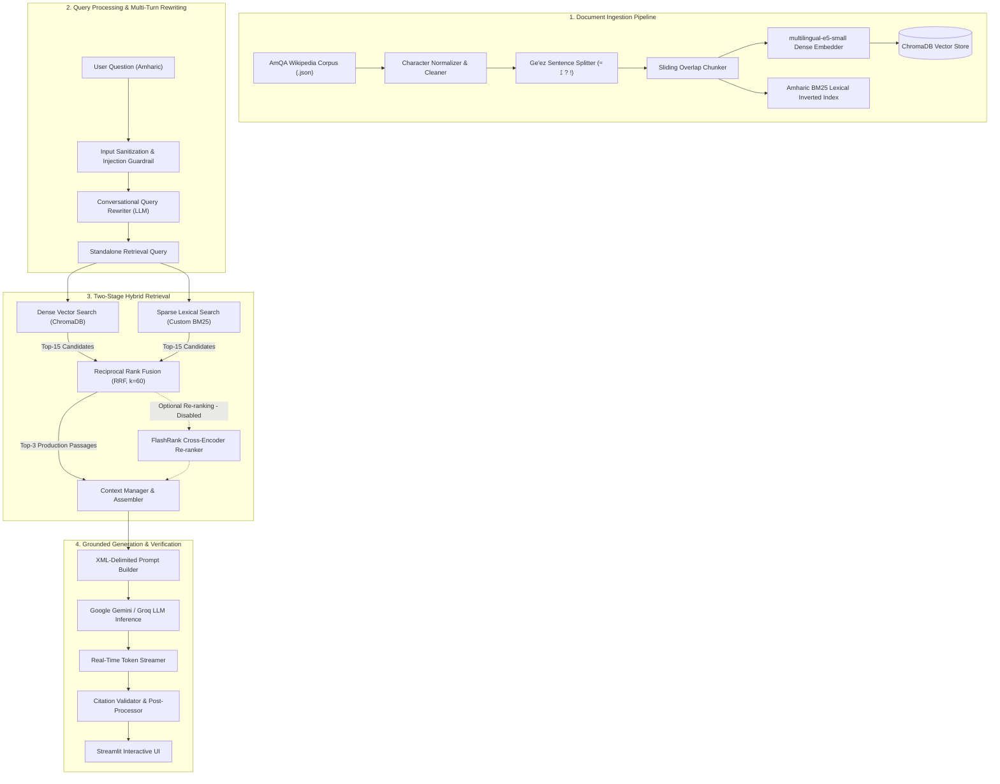
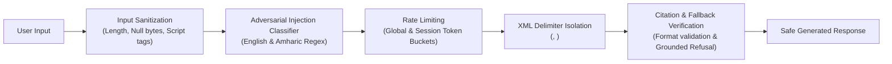

# Amharic RAG: Hybrid Retrieval for a Low-Resource Language

*A retrieval-augmented QA system built and benchmarked on a 286-document AmQA Wikipedia corpus — solving real Ge'ez-script and morphology problems that break standard multilingual embeddings.*

---

## Problem Context & Low-Resource NLP Challenges

Amharic (አማርኛ) is the second most spoken Semitic language globally with over 57 million speakers, yet it remains critically under-served in modern Natural Language Processing and information retrieval pipelines. Building RAG systems for Amharic poses unique linguistic and architectural challenges:

1. **Morphological Richness & Agglutination:** Amharic exhibits complex root-and-pattern (non-concatenative) morphology. Prepositions (`ከ`, `በ`, `ለ`, `የ`), conjunctions (`እና`, `ስለ`), possessive suffixes (`-ኦቻችን`, `-አቸው`), and definite articles are affixed directly to nouns, verbs, and adjectives. Standard whitespace tokenizers treat `ለተባበሩት` ("for the united") and `የተባበሩት` ("of the united") as completely disjoint tokens, causing severe lexical mismatch in naive search.
2. **Sub-Word Fragmentation in Dense Embeddings:** Pretrained multilingual embedding models (e.g. multilingual-e5, mBERT) allocate a negligible proportion of their vocabulary budget to the Ethiopic/Ge'ez Unicode block (`U+1200` to `U+137F`). This results in severe sub-character and multi-piece token fragmentation, diluting vector semantic density for domain-specific named entities and acronyms.
3. **Exact Acronym & Named Entity Failure:** Dense vector search frequently maps domain-specific Ethiopian acronyms (e.g., `የተ.መ.ድ` for UN, `ዩኤን ኤድስ` for UNAIDS, `ኢዜአ` for ENA) to vague generic regions in vector space, failing to achieve top-rank precision for factual lookups.
4. **Adversarial & Delimiter Vulnerabilities:** Multilingual LLMs often misinterpret mixed-language prompt-injection attempts or cross-lingual jailbreak phrasing unless protected by rigorous character sanitization, delimiter isolation, and bilingual boundary defense classifiers.

Beyond the specific dataset, this project demonstrates a transferable pattern: building retrieval and generation systems for languages and scripts that standard multilingual NLP tooling underserves. The techniques here — Ethiopic-aware tokenization, hybrid dense/lexical fusion to compensate for embedding fragmentation, adversarial guardrails in a low-resource language — generalize to other underrepresented languages facing the same architectural gaps. This is a technical foundation, rigorously benchmarked and honestly evaluated end-to-end (see [Known Limitations](#known-limitations)), rather than a deployed product serving a defined user base today.

To overcome these limitations, this system implements a **Two-Stage Hybrid Retrieval Pipeline** combining custom Ethiopic lexical BM25 tokenization, dense cosine embeddings, Reciprocal Rank Fusion (RRF), and optional cross-encoder re-ranking (disabled by default in production), wrapped in an end-to-end multi-turn conversational workflow with strict factual grounding.

<div align="center">

[](https://www.python.org/)
[](https://streamlit.io/)
[](https://www.trychroma.com/)
[-lightgrey)](https://github.com/PrithivirajDamodaran/FlashRank)
[](https://ai.google.dev/)
[](https://groq.com/)
[](https://docs.pytest.org/)
[](LICENSE)

[Explore Live Demo](https://amharic-rag-assistant.streamlit.app/) • [Architecture](#1-system-architecture) • [Retrieval Benchmarks](#3-empirical-evaluation--retrieval-benchmarks) • [Quickstart](#6-quickstart-runbook)

</div>

---

## 1. System Architecture



### Architecture Walkthrough

1. **Amharic-Aware Chunker:** Respects Ge'ez sentence termination markers (`።` Arat Neteb, `፤` Semicolon, `?`, `!`) with configurable sliding overlap (e.g. 500 characters, 100 character overlap) to preserve morphological context across paragraph boundaries.
2. **Dual-Index Ingestion:**
   - **Dense Index:** Chunks are prefixed (`passage: `) and embedded using `intfloat/multilingual-e5-small` into a persistent local ChromaDB instance with cosine similarity indexing.
   - **Lexical Index:** In-memory BM25 index built with a dedicated regex tokenizer (`[\w\u1200-\u137F]+`) to index Amharic and Latin tokens simultaneously.
3. **Conversational Multi-Turn Query Rewriter:** When a user asks follow-up questions with pronouns or omitted subjects (e.g., Turn 1: *"ስለ አቡነ ባስልዮስ ንገረኝ"*, Turn 2: *"የተወለዱት መቼ ነው?"*), the conversational rewriter resolves references to synthesize a standalone search query (`"አቡነ ባስልዮስ የተወለዱት መቼ ነው?"`) before querying the retrieval indices.
4. **Two-Stage Re-ranking (Supported, Disabled by Default):**
   - **Stage 1 (Candidate Generation & Production Retrieval):** Dense search and BM25 retrieve top-15 candidates each. Reciprocal Rank Fusion ($Score = \sum \frac{1}{60 + \text{rank}}$) merges the lists to ensure both semantic depth and exact acronym/keyword matches are captured, serving top-$k$ results directly in production (`use_reranker=False`).
   - **Stage 2 (Cross-Encoder Re-ranking Architecture):** A modular `Reranker` class (`FlashRank` / `SentenceTransformers`) is implemented in code with unit tests and fallback logic, but remains disabled by default because no CPU-feasible multilingual re-ranker has been validated for Amharic at production scale.
5. **Grounded Generation & Inline Citations:** Retrieved evidence is formatted within strict XML delimiters (`<retrieved_evidence>`). The generator must substantiate every statement with inline citation anchors (e.g., `[1]`, `[2]`). If evidence is insufficient, the system emits an automated grounded refusal.

---

## 2. Technology Stack

| Layer | Technology | Specification & Purpose |
|---|---|---|
| **Web Interface** | Streamlit 1.61+ | Live token-by-token streaming, custom Amharic typography (Noto Sans Ethiopic), telemetry dashboard |
| **Re-ranking Engine** | FlashRank 0.2.10 | Local ONNX cross-encoder re-ranking module (implemented; disabled by default in production) |
| **Vector Database** | ChromaDB 1.5.9 | Local persistent cosine distance vector store |
| **Embeddings** | `intfloat/multilingual-e5-small` | 384-dimensional dense semantic vector representations |
| **Lexical Engine** | Custom In-Memory BM25 | Pure Python BM25 ranking ($k_1=1.5, b=0.75$) with Ethiopic regex tokenization |
| **LLM Inference** | Google Gemini / Groq | `gemini-2.5-flash` / `openai/gpt-oss-120b` for rewriting and answer generation |
| **Quality & CI** | Pytest 9.1.1 + GitHub Actions | Automated 29-test verification suite covering chunking, citations, security, rate limiting, and hybrid retrieval |
| **Deployment** | Docker (`python:3.11-slim`) | Multi-stage containerization with pre-baked dependencies |

---

## 3. Empirical Evaluation & Retrieval Benchmarks

Benchmarking was conducted on the holdout evaluation split comprising **329 unseen AmQA test questions** across ~286 passage-level documents (`split_seed=42`, `holdout_ratio=0.2`).

### 3.1 Retrieval Pipeline Progression

| Pipeline Configuration | Hit@1 | Hit@3 | MRR (Mean Reciprocal Rank) | Context Recall | Status |
|---|:---:|:---:|:---:|:---:|:---:|
| **Dense Vector Search Only** (`multilingual-e5-small`) | 72.64% | 83.89% | 0.7781 | 84.80% | Baseline |
| **Lexical Search Only** (Custom BM25) | 68.39% | 82.37% | 0.7482 | 82.37% | Baseline |
| **Hybrid Retrieval (Dense + BM25 via RRF, $k=60$)** | **77.51%** | **92.10%** | **0.8430** | **92.71%** | **Active (Default) (`use_reranker=False`)** |

### 3.2 Engineering Key Findings

1. **Dense vs. BM25 Synergy:** While dense retrieval excels at semantic similarity, BM25 dominates on specific numbers, dates, and named entities. Fusing them with Reciprocal Rank Fusion (RRF, $k=60$) yielded a **+4.87 percentage point boost in Hit@1** (from 72.64% to 77.51%) and **+6.49 pp in MRR** (0.7781 to 0.8430).
2. **Re-ranking: Investigated, Not Shipped:** An English-only FlashRank cross-encoder (`ms-marco-TinyBERT-L-2-v2`) was evaluated first and found broken for Amharic due to out-of-vocabulary tokenization (all Ethiopic text mapped to `[UNK]`, collapsing Hit@1 to 11.55%). A multilingual cross-encoder (`BAAI/bge-reranker-v2-m3`) was tested next and confirmed linguistically viable with 2,986 Ethiopic tokens. However, full cross-attention inference proved computationally prohibitive on CPU at production/eval scale (~66s per query, scaling to ~6 hours for the full 329-question holdout set), so re-ranking is disabled (`use_reranker=False`) in production.
3. **Acronym Disambiguation Case Study:**
   - **Query:** `"የተ.መ.ድ አካል ዩኤን ኤድስ በምን ላይ ትኩረት አድርጎ ይሠራል?"` (What does the UN agency UNAIDS focus on?)
   - **Gold Document:** `451675`
   - *Dense Baseline:* Ranked at **#2** (semantic drift).
   - *BM25 Lexical:* Ranked at **#1** (exact keyword matching).
   - *Hybrid RRF:* Ranked at **#1** (exact match + semantic confirmation).

### 3.3 Generation Quality Evaluation

Beyond retrieval accuracy, answer *generation* quality was evaluated using an LLM-as-judge methodology (Gemini) scoring three dimensions — Faithfulness (grounded in retrieved context, no hallucination), Relevance (addresses the question asked), and Correctness (matches ground truth) — each on a 1-5 scale.

**Judge validity check:** before trusting these scores, the judge was tested against deliberately incorrect answers. A fully fabricated answer (wrong country, wrong capital) scored 1/1/1. A plausible but factually wrong answer (correct topic, wrong number) scored Relevance 5 / Faithfulness 1 / Correctness 1 — confirming the judge discriminates on each dimension independently rather than defaulting to high scores.

| Metric | Score (15/15 questions) |
|---|:---:|
| Faithfulness | 5.0 / 5.0 |
| Relevance | 5.0 / 5.0 |
| Correctness | 5.0 / 5.0 |

All 15 evaluated questions — spanning factual lookups (dates, monetary figures, named officials), acronym resolution (UNAIDS), and multi-point synthesis (health effects of snoring, requiring the system to combine two separate facts from context) — received perfect scores across all three dimensions, with every answer correctly citing its source passage.

**Scope note:** this evaluation covers 15 of 329 holdout questions — a small, quota-constrained sample, not full-scale generation benchmarking. It demonstrates end-to-end generation quality on this subset rather than a statistically comprehensive claim across the full holdout set.

---

## 4. Safety & Reliability Guardrails



### 1. Adversarial Injection & Jailbreak Defense
- **Bilingual Pattern Matching:** `src/security.py` inspects incoming queries for canonical jailbreak phrases in both English (`"ignore previous instructions"`, `"system override"`) and Amharic (`"የቀደመውን መመሪያ እርሳው"`, `"ሁሉንም ህግ ጣስ"`).
- **XML Delimiter Isolation:** Prompts format context and user queries into strict XML containers (`<retrieved_evidence>`, `<user_question>`). LLM system instructions explicitly mandate treating content within evidence tags as data only.

### 2. Grounded Refusal & Hallucination Suppression
- When retrieved evidence yields insufficient context or similarity scores fall below threshold, the system immediately returns a standard refusal phrase without invoking ungrounded model hallucination:
  > *"ከተሰጡት ሰነዶች በመነሳት ጥያቄውን መመለስ አልተቻለም።"*  
  > (Translation: "It is not possible to answer this question based on the provided documents.")

### 3. Graceful Fallback & Modular Re-ranking
- `FlashRank` / cross-encoder re-ranking is fully modular and wrapped in isolated try/except handlers (`use_reranker=False` by default). When enabled experimentally, any runtime initialization failure automatically falls back to raw RRF ranking without user disruption.

### 4. Rate Limiting & Token Quotas
- Built-in token-bucket rate limiter (`src/rate_limiter.py`) protects upstream inference quotas, accompanied by an interactive session reset counter in the Streamlit UI.

---

## 5. Repository Structure

```
amharic-rag-assistant/
├── .github/
│   └── workflows/
│       └── ci.yml             # GitHub Actions CI workflow (Python 3.11)
├── src/
│   ├── chunker.py             # Ge'ez sentence-boundary text chunker (Arat Neteb aware)
│   ├── citations.py           # Inline citation parsing [1], [2] & metadata mapping
│   ├── context_manager.py     # Prompt token budget & evidence assembly
│   ├── document_loader.py     # AmQA JSON dataset loader and validator
│   ├── embedding_generator.py # E5 dense vector embeddings & ChromaDB indexing
│   ├── errors.py              # Typed domain exception classes
│   ├── eval_api.py            # API-based evaluation utilities
│   ├── eval_utils.py          # Benchmark metrics (Hit@K, MRR, Context Precision/Recall)
│   ├── history_manager.py     # Multi-turn conversation sliding window
│   ├── hybrid_retriever.py    # BM25 Retriever, RRF Fusion & FlashRank Re-ranker
│   ├── input_validation.py    # Input validation, sanitization & security gateway
│   ├── llm.py                 # Unified LLM provider client (Google Gemini / Groq)
│   ├── logging_config.py      # Structured JSON event logging & telemetry
│   ├── pipeline.py            # End-to-end RAG pipeline orchestrator
│   ├── prompt_builder.py      # XML-delimited prompt templates & instructions
│   ├── query_normalization.py # Amharic character normalization & diacritic handling
│   ├── query_rewriter.py      # Multi-turn query rewriting for standalone retrieval
│   ├── rate_limiter.py        # Token-bucket rate limiter & quota manager
│   ├── retriever.py           # Dense semantic ChromaDB search
│   ├── rewrite_eval.py        # Query rewrite benchmark evaluation
│   ├── security.py            # Injection classifiers & character sanitizers
│   ├── token_counter.py       # Tiktoken / prompt token estimation
│   └── __init__.py            # Package root
├── tests/
│   ├── test_chunker.py        # Sentence splitting & chunking unit tests (5 tests)
│   ├── test_citations.py      # Inline citation parsing & mapping tests (9 tests)
│   ├── test_hybrid_retriever.py # BM25, RRF & FlashRank unit tests (6 tests)
│   ├── test_rate_limiter.py   # Rate limiting & quota test suite (3 tests)
│   └── test_security.py       # Input sanitization & injection tests (6 tests)
├── scripts/
│   ├── ingest_corpus.py       # Corpus ingestion & index generation CLI
│   ├── split_dataset.py       # Train / holdout split generator (seed=42)
│   ├── eval_retrieval.py      # Single-turn retrieval benchmark runner
│   ├── eval_conversation_retrieval.py # Multi-turn retrieval evaluation
│   ├── eval_rewrite_only.py   # Query rewriting performance evaluator
│   ├── eval_generate.py      # End-to-end answer generation evaluator
│   └── run_all_evals.py       # Full evaluation suite orchestrator
├── data/
│   ├── raw/train_data.json    # AmQA Wikipedia knowledge corpus
│   └── splits/                # Train and holdout benchmark splits
├── results/                   # JSON benchmark evaluation logs & artifacts
├── app.py                     # Primary Streamlit web application with live streaming
├── main.py                    # Single-turn CLI execution entrypoint
├── config.py                  # Pydantic environment configuration & settings
├── pytest.ini                 # Pytest runner configuration
├── Dockerfile                 # Multi-stage Docker container definition
├── requirements.txt           # Python package dependencies
└── .env.example               # Environment variables configuration template
```

---

## 6. Quickstart Runbook

### Prerequisites
- Python 3.10, 3.11, or 3.14
- Google Gemini API Key (or Groq API Key)

### 1. Clone & Setup Virtual Environment

```bash
# Clone the repository
git clone https://github.com/IsaakAlemu/amharic-rag-assistant.git
cd amharic-rag-assistant

# Create virtual environment
python -m venv .venv

# Activate virtual environment
# Windows:
.venv\Scripts\activate
# macOS / Linux:
source .venv/bin/activate
```

### 2. Install Dependencies

```bash
pip install --upgrade pip
pip install -r requirements.txt
```

### 3. Configure Environment Variables

```bash
# Copy environment template
# Windows:
copy .env.example .env
# macOS / Linux:
cp .env.example .env
```

Edit `.env` to configure your API keys:

```env
# Primary LLM Configuration
LLM_PROVIDER=gemini
GEMINI_API_KEY=your_google_gemini_api_key_here

# Optional: Groq Configuration
# LLM_PROVIDER=groq
# GROQ_API_KEY=your_groq_api_key_here

# Retrieval & Model Settings
EMBED_MODEL=intfloat/multilingual-e5-small
TOP_K=3
```

### 4. Run the Test Suite (29 Tests)

```bash
pytest tests/ -v
```

Expected output:
```text
tests/test_chunker.py ......... PASSED [17%]
tests/test_citations.py ......... PASSED [48%]
tests/test_hybrid_retriever.py ...... PASSED [68%]
tests/test_rate_limiter.py ... PASSED [79%]
tests/test_security.py ...... PASSED [100%]

============================= 29 passed in 0.65s =============================
```

> **Note:** The full test suite (29/29) requires `flashrank` installed per `requirements.txt`. Without it, `test_reranker_execution_and_top_k` fails locally due to the re-ranker's fallback behavior (showing 28/29 passed); CI installs the full dependency set so all 29 pass.

### 5. Launch the Web Application

```bash
streamlit run app.py
```

Open `http://localhost:8501` in your browser. On initial boot:
1. `intfloat/multilingual-e5-small` weights are loaded.
2. The ChromaDB vector store and BM25 index initialize automatically.
3. Hybrid retrieval serves fused RRF rankings directly (re-ranking disabled by default).

### 6. Single-Turn CLI Mode

```bash
python main.py
```

### 7. Run Retrieval Evaluation Suite

```bash
# Run 329-question holdout benchmark evaluation
python scripts/eval_retrieval.py --index-mode full
```

---

## 7. Docker Deployment

Build and run using the Docker container:

```bash
# Build Docker image
docker build -t amharic-rag-assistant:latest .

# Run container with environment configuration
docker run -d -p 8501:8501 --env-file .env --name amharic-rag amharic-rag-assistant:latest
```

Navigate to `http://localhost:8501`.

---

## Known Limitations

This system demonstrates a rigorous, honestly-evaluated RAG pipeline for Amharic — not a production deployment serving real users at scale. Specific limitations:

- **Corpus size:** the knowledge base covers 286 Wikipedia articles/paragraphs — sufficient to demonstrate retrieval and generation quality, but far short of the breadth a real-world Amharic QA system would need.
- **Retrieval ceiling:** a top-k sweep on the 329-question holdout set found that even a perfect re-ranker at top-10 tops out at 89.36% Hit@10 — 35 of 89 failures have the gold document missing from the top-10 entirely, meaning some questions are not answerable by this retrieval architecture regardless of ranking improvements.
- **Re-ranking disabled:** a cross-encoder re-ranking stage is implemented and tested but disabled in production — an English-only model failed on Amharic tokenization entirely, and a multilingual alternative that worked linguistically was too computationally expensive on CPU at this scale.
- **Generation eval sample size:** the generation-quality evaluation (Faithfulness/Relevance/Correctness) covers 15 of 329 holdout questions, constrained by free-tier judge-model quota — a real signal of quality, not a statistically comprehensive benchmark.
- **Security guardrails are pattern-based:** prompt-injection and jailbreak detection use regex pattern matching in English and Amharic, which catches known attack phrasings but is not resistant to novel adversarial phrasing an ML-based classifier might catch.
- **Dataset scope:** built and evaluated against Amharic Wikipedia and the AmQA benchmark — a controlled academic dataset, not live user queries or a documented user population.

---

## 8. Author & License

- **Author:** [Isaak Alemu](https://github.com/IsaakAlemu)  
- **Project:** Amharic RAG: Hybrid Retrieval for a Low-Resource Language  
- **License:** [MIT License](LICENSE) (2026 Isaak Alemu)
